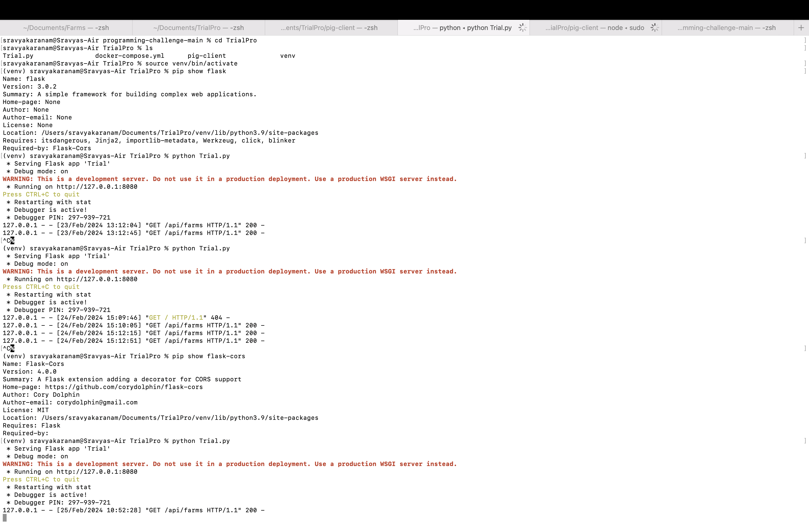
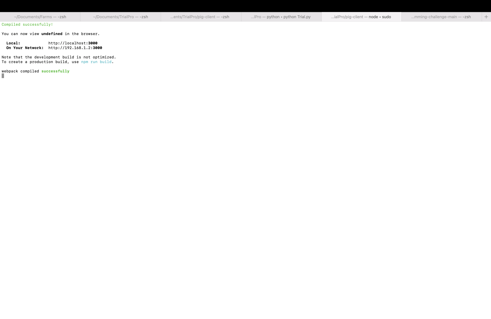
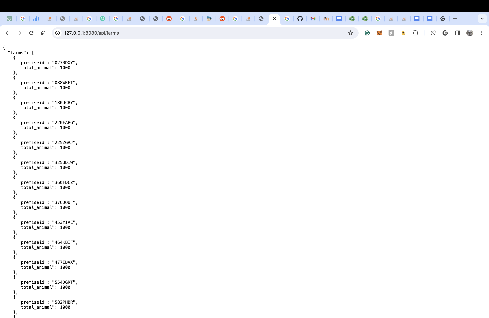
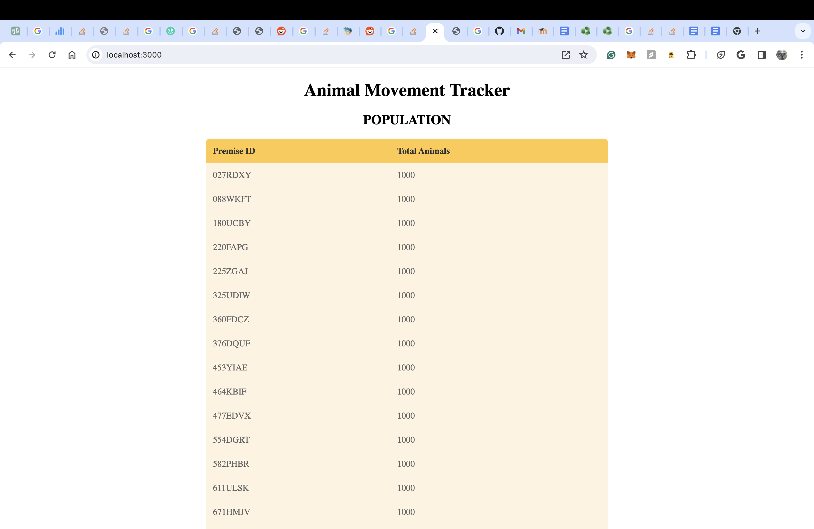
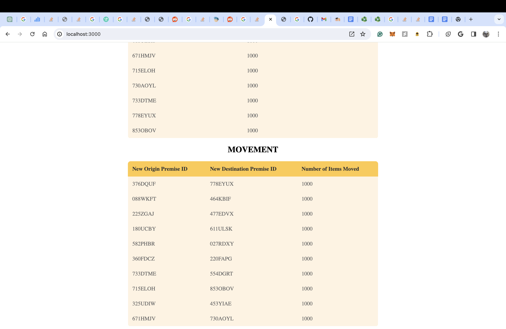

Steps followed to build task ( MAC OS ):

---

### Setting up the MySQL Database:
To set up the MySQL database for tracking population and movements, follow these steps:

1. **Create Database and Tables:**

    First, create two tables named `Population` and `Movements` using the following SQL queries:

    ```sql

    create database farm_movement;
    use farm_movement;

    
    -- POPULATION table
    CREATE TABLE population (
        premiseid VARCHAR(255) PRIMARY KEY,
        total_animal INT
    );

    -- MOVEMENTS table
    CREATE TABLE movements (
        new_originpremid VARCHAR(100),
        new_destinationpremid VARCHAR(100),
        new_numitemsmoved INT,
        FOREIGN KEY (new_originpremid) REFERENCES population(premiseid),
        FOREIGN KEY (new_destinationpremid) REFERENCES population(premiseid)
    );
    ```

    The `Population` table stores information about premises and their total animals, while the `Movements` table tracks movements between premises.

    *Note: Adjust VARCHAR lengths and data types according to your specific requirements.*

2. **Populate Database**

   ```
   ( number of columns of population.csv, and movements.csv must match number of columns in tables created )
   
   -- Load data into the population table
    LOAD DATA INFILE 'population.csv'
    INTO TABLE population
    FIELDS TERMINATED BY ',' ENCLOSED BY '"'
    LINES TERMINATED BY '\n'
    IGNORE 1 ROWS; -- Ignore header row if present
    
    -- Load data into the movements table
    LOAD DATA INFILE 'movement.csv'
    INTO TABLE movements
    FIELDS TERMINATED BY ',' ENCLOSED BY '"'
    LINES TERMINATED BY '\n'
    IGNORE 1 ROWS; -- Ignore header row if present
   ```

##  Executing the project :
```
    git clone
    cd programming-challenge-main
    cd TrialPro
    
```
#### 1. Setting up the REST API using FLASK(python):

```
    pip install requirements.txt
    source venv/bin/activate                                         //to activate the virtual environment # On Windows: venv\Scripts\activate
    python Trial.py

```
 open `http://127.0.0.1:8080/api/farms` to see the data fetched from Database
    
#### 2. Setting up the WEB CLIENT , using Typescript and react:

Open Different Terminal Tab and follow the steps: 

```
    cd pig-client
    sudo npx create-react-app . --template typescript
    sudo npm install axios
    sudo npm start

```
open `http://localhost:3000/` to see the output of pig-client

possible errors you may encounter: permission denied error

solution: `chmod -R 755 /path till TrialPro/TrialPro/pig-client`


#### 3. Docker instructions:
```
    docker-compose up --build
```
If there is any error in displaying the data after docker compose, please run the server script seperately in a terminal tab as mentioned in step 1. 
i.e, `python Trial.py`

## Execution Demo:

<p align="center"></p>

##  OUTPUT Screenshots after execution:

### :Server API : 
<p align="center"></p>

### :Client : 
<p align="center"></p>

### :Server output : 
<p align="center"></p>

### :Client Output : 
<p align="center"></p>
<p align="center"></p>
